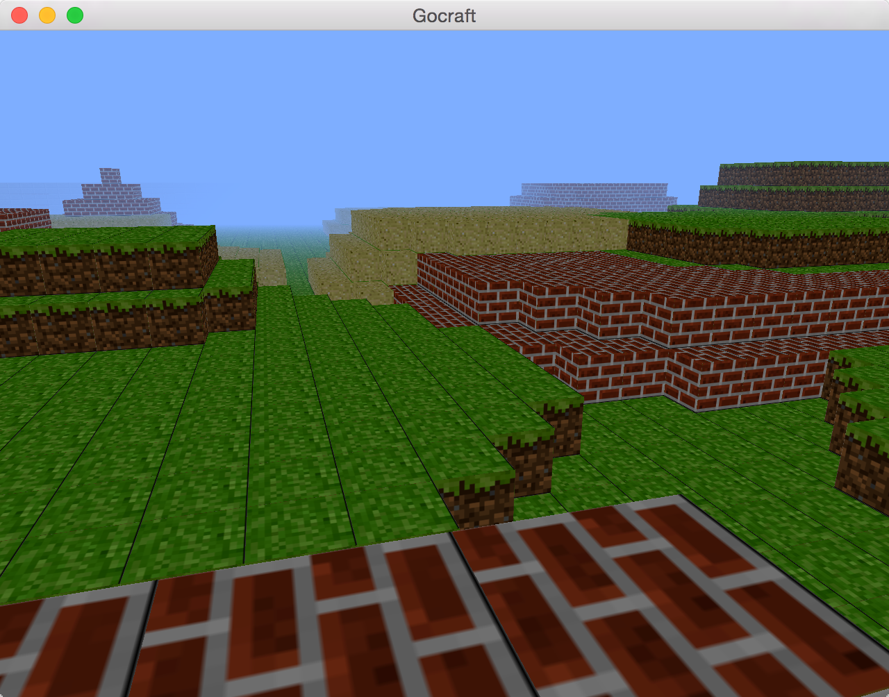

This is small example 3D golang Minecraft game.
Its meant as a proof-of-concept 3d game in Go.
Its kept as simple as possible with few features.

go-gl and glfw pkgs are used, but no other frameworks.

### Source

This is a fork and transliteration of a python project written by @fogleman.

! _**The original README from the python project is inluded as README.original.md. The license is keps the same.**_

### Screenshot

### TODO

- [ ] sector hiding is disabled due to bug.
- [ ] hud (label) is disabled
